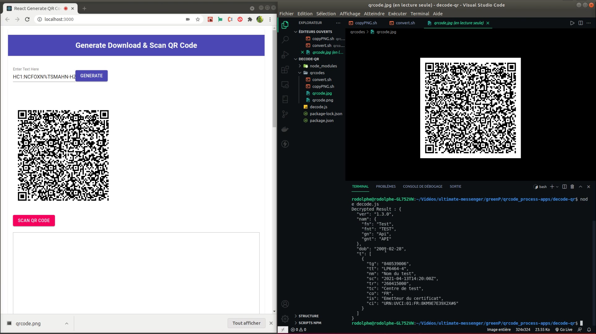

# 🇫🇷 Application pour décrypter le QRcode du greenPass europe.
A titre d'information seulement !

# 🇬🇧 App for decrypt greenPass europe QRcode.
Just for information purpose only!

---

***🇫🇷 Voici une courte démonstration vidéo de l'utilisation de l'app***

***🇬🇧 Here is a short video demonstration of how to use the app***

## 🇫🇷 cliquez sur l'image pour voir la vidéo!
## 🇬🇧 click on the image to see the video!

---

# 🇫🇷 Comment utiliser cette app

Clonez ou télécharger le repo, rendez vous dans les dossiers "qrcode-app" et "decode-qr puis faite :

 `yarn` ou `npm i`

afin d'installer les dépendances!

# 🇬🇧 How to use this app

Clone or download the repo, go to the "qrcode-app" and "decode-qr" folders and do :

 `yarn` or `npm i`

to install the dependencies!

## 🇫🇷 deuxième étape :

Voous pouvez démarrer l'app react avec la procedure habituelle, en faisant

 `yarn start` ou `npm start`

dans le dossier "qrcode-app".

L'application démarre sur le port 3000 habituel.
[http://localhost:3000](http://localhost:3000)

## 🇬🇧 second step :

You can start the react app with the usual procedure, by doing

 `yarn start` or `npm start`.

in the "qrcode-app" folder.

The application starts on the usual port 3000.
[http://localhost:3000](http://localhost:3000)

## 🇫🇷 Scanne du qrcode :

Vous pouvez scanner votre qr-code,

une fois ceci fait, il vous faut copier les infos cryptés afin de générer un qr-code.

En cliquant sur l'image fraichement créées le téléchargement se lance...

Ensuite,
Il vous faut copier l'image dans le dossier "qrcodes" présent dans le dossier "decode-qr". (si vous pouvez executer du bash sur votre ordinateur, vous pouvez modifier le script copyPNG.sh pour qu'il fonctionne avec votre arborescence de dossier, sinon copiez la manuellement)!

L'étape suivante est de convertir l'image png en jpg pour en facilité le décryptage.
Si vous pouvez executer du shell script sur votre ordi, vous avez un script "convert.sh qui vous feras ça très bien (Dans la console, à la racine du dossier "qrcodes" faite juste ./convert.sh) sinon utiliser le logiciel gimp par exemple.

Pour finir, rendez-vous à présent dans le dossier "decode-qr" et faite :

### `node decode.js`

dans un autre onglet de terminal!

## 🇬🇧 Scanning the qrcode:

You can scan your qr-code,

once this is done, you have to copy the encrypted information to generate a qr-code.

By clicking on the freshly created image the download starts...

Then,
You have to copy the image in the folder "qrcodes" present in the folder "decode-qr". (if you can run bash on your computer, you can modify the copyPNG.sh script to work with your folder tree, otherwise copy it manually)!

The next step is to convert the png image to jpg for easy decryption.
If you can run shell script on your computer, you have a script "convert.sh" that will do this very well (In the console, at the root of the folder "qrcodes" just make ./convert.sh) otherwise use the gimp software for example.

To finish, go to the "decode-qr" folder and do :

### `node decode.js`

in another terminal tab!

---

## 🇫🇷 Cette application n'a en aucun cas était faite pour tenter de contourner la loi, de quelques manières que ce soit...

C'est juste au titre de ma curiositée personnelle et du droit d'accès aux informations nous concernants.

## 🇬🇧 This application was in no way made to try to circumvent the law, in any way whatsoever...

It's just for my personal curiosity and the right of access to information about us.

---

## 🇫🇷 Disclamer :
Le qr code testé ici ainsi que dans la vidéo que j'ai partagé sur linkedin est un qrcode de test présent sur le repo officiel "eu-digital-green-certificates", dont voici le lien :

[TestData-tous-pays](https://github.com/eu-digital-green-certificates/dgc-testdata)

[FR](https://github.com/eu-digital-green-certificates/dgc-testdata/tree/main/FR)

## 🇬🇧 Disclamer :
The qr code tested here as well as in the video I shared on linkedin is a test qrcode present on the official repo "eu-digital-green-certificates", which here is the link :

[TestData-tous-pays](https://github.com/eu-digital-green-certificates/dgc-testdata)

[FR](https://github.com/eu-digital-green-certificates/dgc-testdata/tree/main/FR)
